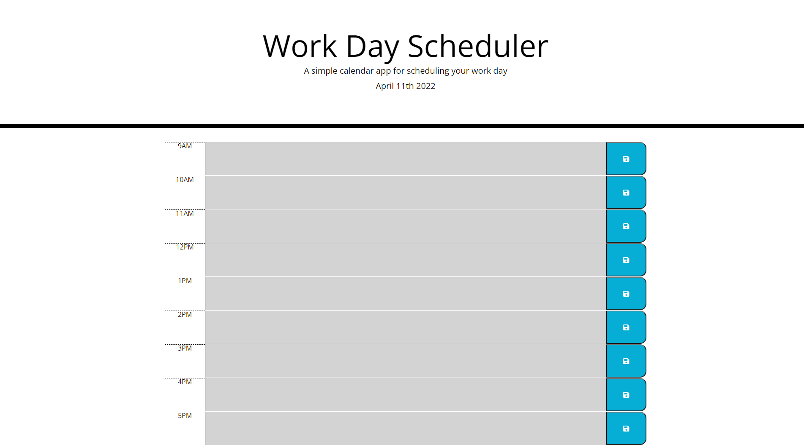

# Work Day Scheduler

## Description
This repository contains a webpage for a work day scheduler. Text can be input for each hour of the working day. Varying background color provides a visual cue indicating whether the hour has passed, is present, or is in the future. These backgrounds update on load, as well as every hour on the hour.

Technologies used include HTML, CSS, Javascript, Bootstrap, and JQuery.

## Features
* The current date is displayed at the top of the screen
* Text entered in the scheduler can be saved so that it persists and will be returned whenever the page is loaded
* A new day will provide a blank slate where previously saved entries will be cleared
* Altering the text of the scheduler whithout saving will cause the save buttons to flash red until the change has been saved
* Background cues update automatically denoting the relationship of the planned hour to real time

## Links

[Deployed website](https://wgrout87.github.io/daily-planner/)

[Code repository](https://github.com/wgrout87/daily-planner)

## Usage
This repository contains a work day scheduler webpage, which can be viewed on a variety of devices as it has been configured for multiple screen dimensions. Plans made for the current day can be saved to be reloaded on refresh or reload. Visual cues are used to convey important information relating to the usage of this scheduler.

The deployed website should resemeble the following screenshot.

## Credits
This code was in part a colaboration with Kansas Carver and Alex Lathrop, who helped iron out the details of the HTML.
The HTML and CSS content, as well as a small but important portion of the JavaScript was provided by the University of Utah Coding Bootcamp. It was written by Xander Rapstine.
